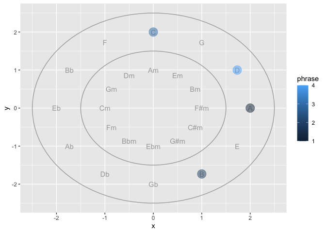
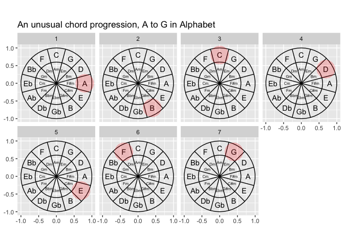

  - [Part 0. Proposal](#part-0-proposal)
  - [Part I. Work out functionality ✅](#part-i-work-out-functionality-)
      - [Try it out](#try-it-out)
  - [Part II. Packaging and documentation 🚧
    ✅](#part-ii-packaging-and-documentation--)
      - [Phase 1. Minimal working
        package](#phase-1-minimal-working-package)
          - [Bit A. Created package archetecture, running
            `devtools::create(".")` in interactive session. 🚧
            ✅](#bit-a-created-package-archetecture-running-devtoolscreate-in-interactive-session--)
          - [Bit B. Added roxygen skeleton? 🚧
            ✅](#bit-b-added-roxygen-skeleton--)
          - [Bit C. Managed dependencies ? 🚧
            ✅](#bit-c-managed-dependencies---)
          - [Bit D. Moved functions R folder? 🚧
            ✅](#bit-d-moved-functions-r-folder--)
          - [Bit E. Run `devtools::check()` and addressed errors. 🚧
            ✅](#bit-e-run-devtoolscheck-and-addressed-errors--)
          - [Bit F. Build package 🚧 ✅](#bit-f-build-package--)
          - [Bit G. Write traditional README that uses built package
            (also serves as a test of build. 🚧
            ✅](#bit-g-write-traditional-readme-that-uses-built-package-also-serves-as-a-test-of-build--)
          - [Bit H. Chosen a license? 🚧 ✅](#bit-h-chosen-a-license--)
          - [Bit I. Add lifecycle badge
            (experimental)](#bit-i-add-lifecycle-badge-experimental)
      - [Phase 2: Listen & iterate 🚧 ✅](#phase-2-listen--iterate--)
      - [Phase 3: Let things settle](#phase-3-let-things-settle)
          - [Bit A. Settle on examples. Put them in the roxygen skeleton
            and readme. 🚧
            ✅](#bit-a-settle-on-examples-put-them-in-the-roxygen-skeleton-and-readme--)
          - [Bit B. Written formal tests of functions and save to test
            that folders 🚧
            ✅](#bit-b-written-formal-tests-of-functions-and-save-to-test-that-folders--)
          - [Bit C. Added a description and author information in the
            DESCRIPTION file 🚧
            ✅](#bit-c-added-a-description-and-author-information-in-the-description-file--)
          - [Bit D. Addressed *all* notes, warnings and errors. 🚧
            ✅](#bit-d-addressed-all-notes-warnings-and-errors--)
      - [Phase 4. Promote to wider
        audience…](#phase-4-promote-to-wider-audience)
          - [Bit A. Package website built? 🚧
            ✅](#bit-a-package-website-built--)
          - [Bit B. Package website deployed? 🚧
            ✅](#bit-b-package-website-deployed--)
      - [Phase 5: Harden/commit](#phase-5-hardencommit)
          - [Submit to CRAN/RUniverse? 🚧 ✅](#submit-to-cranruniverse--)
  - [Appendix: Reports, Environment](#appendix-reports-environment)
      - [Edit Description file](#edit-description-file)
      - [Environment](#environment)
      - [`devtools::check()` report](#devtoolscheck-report)

# Part 0. Proposal

Proposing the {ggcircleof5ths} package\! 🦄
<!-- (typical package introduction write up; but actually aspirational) -->

The goal of {ggcircleof5ths} is to make … easier.

Without the package, we live in the effort-ful world that follows 🏋:

``` r

major = c("C", "G", "D", "A", "E", "B",
            "Gb","Db", "Ab", "Eb", "Bb", "F")
minor = c("Am", "Em", "Bm", "F#m", "C#m", "G#m", "Ebm",
            "Bbm", "Fm", "Cm", "Gm", "Dm")


get_key_index <-function(key){
  
  if(key %in% major){key_index <- which(major == key)}
  if(key %in% minor){key_index <- which(minor == key)}
  key_index
  
} 

get_key_index(key = "D")
#> [1] 3


wrap_vector <- function(x, key){
  
  len <- length(x)
  start_index <- get_key_index(key)
  
  c(x[start_index:len], x[1:(start_index-1)])
  
}


spot = 1:12
library(ggstamp)
ggcanvas() +
  stamp_circle(radius = 1.4, x0 = 0, y0 = 0) +
  stamp_text(xy = pos_polygon(x0 = 0, y0 = 0, n = 12,
             radius = 1.1),
             label = wrap_vector(major, "D"),
             size = 6) +
  stamp_circle(radius = .8,x0 = 0, y0 = 0) +
  stamp_text(xy = pos_polygon(n = 12, radius = .5),
             label = wrap_vector(minor, "D"),
             size = 5) +
  stamp_spoke(radius = 1.4, x0 = 0, y0 = 0,
              angle = pi*1:12/6 +
                1/12*pi) + 
  stamp_point(color = "magenta",
              xy = pos_polygon(n = 12,
             radius = 1.1)[which(wrap_vector(major, "D")=="A"),],
             alpha = .2, size = 20)
```

<!-- -->

``` r
library(tidyverse)
#> ── Attaching core tidyverse packages ─────────────────── tidyverse 2.0.0.9000 ──
#> ✔ dplyr     1.1.0          ✔ readr     2.1.4     
#> ✔ forcats   1.0.0          ✔ stringr   1.5.0     
#> ✔ ggplot2   3.4.4.9000     ✔ tibble    3.2.1     
#> ✔ lubridate 1.9.2          ✔ tidyr     1.3.0     
#> ✔ purrr     1.0.1          
#> ── Conflicts ────────────────────────────────────────── tidyverse_conflicts() ──
#> ✖ dplyr::filter() masks stats::filter()
#> ✖ dplyr::lag()    masks stats::lag()
#> ℹ Use the conflicted package (<http://conflicted.r-lib.org/>) to force all conflicts to become errors
compute_panel_circle <- function(data, scales, n = 15){
  
  data |> 
    mutate(group = row_number()) |> 
    crossing(tibble(z = 0:n)) |>
    mutate(around = 2*pi*z/max(z)) |> 
    mutate(x = x0 + cos(around)*r,
           y = y0 + sin(around)*r) 
  
}

geom_circle <- function(...){
  
  ggtemp:::define_layer_temp(
    required_aes = c("x0", "y0", "r"),
    compute_panel = compute_panel_circle,
    geom = ggplot2::GeomPath,
    ...)
  
}

library(ggplot2)
data.frame(x0 = 0:1, y0 = 0:1, r = 1:2/3) |>
  ggplot() +
  aes(x0 = x0, y0 = y0, r = r) +
  geom_circle() +
  aes(fill = r)
```

<!-- -->

``` r
compute_panel_circle5ths <- function(data, scales, n_vertices = 12, maj = TRUE, key = "C", rotate = 90){
  
  data |> 
    mutate(group = row_number()) |> 
    crossing(tibble(z = 0:n_vertices)) |>
    mutate(around = 2*pi*z/max(z) + rotate/180*pi) |> 
    mutate(xend = x0, yend = y0) |>
    mutate(x = x0 + cos(around)*r,
           y = y0 + sin(around)*r)
  
}


compute_group_spokes_labs <- function(data, scales, maj = T, key = "C", rotate = 90-30){
  
    major = c("C", "G", "D", "A", "E", "B",
            "Gb","Db", "Ab", "Eb", "Bb", "F")
  minor = c("Am", "Em", "Bm", "F#m", "C#m", "G#m", "Ebm",
            "Bbm", "Fm", "Cm", "Gm", "Dm")
  
    if(maj){label <- major}else{label <- minor}

  
  compute_panel_circle5ths(data = data, scales = scales, maj = maj, key = key, rotate = rotate) |>
    slice(-nrow(data)) |>
    mutate(major = major) |>
    mutate(minor = minor) |>
    mutate(label = label)
  
  
}


compute_group_chord_highlight <- function(data, scales, maj = T, key = "C", rotate = rotate){
  
  
  compute_group_spokes_labs(data = data, scales = scales, maj = maj, key = key) |>
    filter(major == chord | minor == chord)
  
  
}


ggtemp:::create_layer_temp("geom_circle",
    required_aes = c("x0", "y0", "r"),
    compute_panel = compute_panel_circle5ths,
    geom = ggplot2::GeomPath)

ggtemp:::create_layer_temp("geom_spoke",
    required_aes = c("x0", "y0", "r"),
    compute_group = compute_group_spokes_labs,
    geom = ggplot2::GeomSegment)

ggtemp:::create_layer_temp("geom_labs",
    required_aes = c("x0", "y0", "r"),
    compute_group = compute_group_spokes_labs,
    geom = ggplot2::GeomText)

ggtemp:::create_layer_temp("geom_chord_highlight",
    required_aes = c("x0", "y0", "r", "chord"),
    compute_group = compute_group_chord_highlight,
    geom = ggplot2::GeomPoint)


library(ggplot2)
library(ggstamp)
ggcanvas() +
  aes(x0 = 0, y0 = 0, r = 1, chord = "C") +
  geom_circle(n_vertices = 50) +
  geom_circle(n_vertices = 50, aes(r = .6)) +
  geom_spoke(rotate = 90/6) +
  geom_labs(maj = T, aes(r = .8)) + 
  geom_labs(maj = F, aes(r = .4)) +
  geom_chord_highlight(aes(r = .8), size = 12, color = "red", alpha = .2)
```

<!-- -->

``` r


tibble(phrase = 1:7, chord = LETTERS[1:7]) |>
  ggplot() + 
    aes(x0 = 0, y0 = 0, r = 1, chord = chord) + 
    geom_circle(n_vertices = 50) +
  geom_circle(n_vertices = 50, aes(r = .6)) +
  geom_spoke(rotate = 90/6) +
  geom_labs(maj = T, aes(r = .8)) + 
  geom_labs(maj = F, aes(r = .4), size = 2) +
  geom_chord_highlight(aes(r = .8), size = 12, color = "red", alpha = .2) + 
  coord_equal() +
  facet_wrap(facet = vars(phrase), nrow = 2) +
  labs(title = "An unusual chord progression, A to G in Alphabet")
```

<!-- -->

With the {xxxx} package, we’ll live in a different world (🦄 🦄 🦄) where
the task is a snap 🫰:

Proposed API:

``` 

library(ggcircleof5ths)

df_chords_lyrics |>
 ggplot() + 
 aes(chords = chords) + 
 facet_wrap(vars = fct_inorder(lyrics)) +
 geom_circle5ths(key = "D", r = .5)
```

# Part I. Work out functionality ✅

Here is a function that will do some work…

``` r
times_two <- function(x){
  
  x*2
  
}
```

## Try it out

``` r
times_two(4)
#> [1] 8
```

# Part II. Packaging and documentation 🚧 ✅

## Phase 1. Minimal working package

### Bit A. Created package archetecture, running `devtools::create(".")` in interactive session. 🚧 ✅

``` r
devtools::create(".")
```

### Bit B. Added roxygen skeleton? 🚧 ✅

Use a roxygen skeleton for auto documentation and making sure proposed
functions are *exported*. Generally, early on, I don’t do much
(anything) in terms of filling in the skeleton for documentation,
because things may change.

### Bit C. Managed dependencies ? 🚧 ✅

Package dependencies managed, i.e. `depend::function()` in proposed
functions and declared in the DESCRIPTION

``` r
usethis::use_package("ggplot2")
```

### Bit D. Moved functions R folder? 🚧 ✅

Use new {readme2pkg} function to do this from readme…

``` r
readme2pkg::chunk_to_r("times_two")
```

### Bit E. Run `devtools::check()` and addressed errors. 🚧 ✅

``` r
devtools::check(pkg = ".")
```

### Bit F. Build package 🚧 ✅

``` r
devtools::build()
```

### Bit G. Write traditional README that uses built package (also serves as a test of build. 🚧 ✅

The goal of the {xxxx} package is to …

Install package with:

    remotes::installgithub("EvaMaeRey/readme2pkg.template")

Once functions are exported you can remove go to two colons, and when
things are are really finalized, then go without colons (and rearrange
your readme…)

``` r
library(mypacakge)  ##<< change to your package name here
mypacakge:::times_two(10)
```

### Bit H. Chosen a license? 🚧 ✅

``` r
usethis::use_mit_license()
```

### Bit I. Add lifecycle badge (experimental)

``` r
usethis::use_lifecycle_badge("experimental")
```

## Phase 2: Listen & iterate 🚧 ✅

Try to get feedback from experts on API, implementation, default
decisions. Is there already work that solves this problem?

## Phase 3: Let things settle

### Bit A. Settle on examples. Put them in the roxygen skeleton and readme. 🚧 ✅

### Bit B. Written formal tests of functions and save to test that folders 🚧 ✅

That would look like this…

``` r
library(testthat)

test_that("calc times 2 works", {
  expect_equal(times_two(4), 8)
  expect_equal(times_two(5), 10)
  
})
```

``` r
readme2pkg::chunk_to_tests_testthat("test_calc_times_two_works")
```

### Bit C. Added a description and author information in the DESCRIPTION file 🚧 ✅

### Bit D. Addressed *all* notes, warnings and errors. 🚧 ✅

## Phase 4. Promote to wider audience…

### Bit A. Package website built? 🚧 ✅

### Bit B. Package website deployed? 🚧 ✅

## Phase 5: Harden/commit

### Submit to CRAN/RUniverse? 🚧 ✅

# Appendix: Reports, Environment

## Edit Description file

``` r
readLines("DESCRIPTION")
```

## Environment

Here I just want to print the packages and the versions

``` r
all <- sessionInfo() |> print() |> capture.output()
all[11:17]
#> [1] ""                                                                         
#> [2] "attached base packages:"                                                  
#> [3] "[1] stats     graphics  grDevices utils     datasets  methods   base     "
#> [4] ""                                                                         
#> [5] "other attached packages:"                                                 
#> [6] " [1] lubridate_1.9.2      forcats_1.0.0        stringr_1.5.0       "      
#> [7] " [4] dplyr_1.1.0          purrr_1.0.1          readr_2.1.4         "
```

## `devtools::check()` report

``` r
devtools::check(pkg = ".")
#> Error in `package_file()`:
#> ! Could not find package root.
#> ℹ Is '.' inside a package?
```
