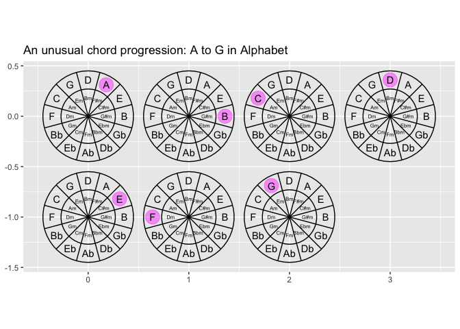
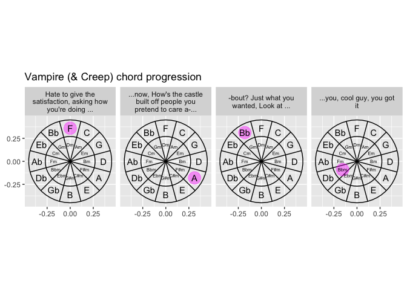

``` r
library(tidyverse)
#> ── Attaching core tidyverse packages ──────────────────────── tidyverse 2.0.0 ──
#> ✔ dplyr     1.1.4     ✔ readr     2.1.6
#> ✔ forcats   1.0.1     ✔ stringr   1.6.0
#> ✔ ggplot2   4.0.1     ✔ tibble    3.3.0
#> ✔ lubridate 1.9.4     ✔ tidyr     1.3.1
#> ✔ purrr     1.2.0     
#> ── Conflicts ────────────────────────────────────────── tidyverse_conflicts() ──
#> ✖ dplyr::filter() masks stats::filter()
#> ✖ dplyr::lag()    masks stats::lag()
#> ℹ Use the conflicted package (<http://conflicted.r-lib.org/>) to force all conflicts to become errors
major = c("C", "G", "D", "A", "E", "B",
            "Gb","Db", "Ab", "Eb", "Bb", "F") |> rev()
minor = c("Am", "Em", "Bm", "F#m", "C#m", "G#m", "Ebm",
            "Bbm", "Fm", "Cm", "Gm", "Dm") |> rev()

create_chord_df <- function(key = "C"){
  
  
  data.frame(major, minor) |>
  mutate(around = row_number()/n()) |>
  mutate(y00 = sin(pi*2 * around + pi/2),
         x00 = cos(pi*2 * around + pi/2)) |>
  pivot_longer(cols = major:minor, 
               names_to = "majmin",
               values_to = "chord") |> 
  mutate(majmin = factor(majmin, levels = c("minor", "major"))) |> 
  mutate(r = as.numeric(majmin)) |>
  mutate(x = x00 * r,
         y = y00 * r) 

}
  
create_chord_df()
#> # A tibble: 24 × 8
#>    around       y00    x00 majmin chord     r      x         y
#>     <dbl>     <dbl>  <dbl> <fct>  <chr> <dbl>  <dbl>     <dbl>
#>  1 0.0833  8.66e- 1 -0.5   major  F         2 -1      1.73e+ 0
#>  2 0.0833  8.66e- 1 -0.5   minor  Dm        1 -0.5    8.66e- 1
#>  3 0.167   5.00e- 1 -0.866 major  Bb        2 -1.73   1.00e+ 0
#>  4 0.167   5.00e- 1 -0.866 minor  Gm        1 -0.866  5.00e- 1
#>  5 0.25    1.22e-16 -1     major  Eb        2 -2      2.45e-16
#>  6 0.25    1.22e-16 -1     minor  Cm        1 -1      1.22e-16
#>  7 0.333  -5   e- 1 -0.866 major  Ab        2 -1.73  -1   e+ 0
#>  8 0.333  -5   e- 1 -0.866 minor  Fm        1 -0.866 -5   e- 1
#>  9 0.417  -8.66e- 1 -0.500 major  Db        2 -1.000 -1.73e+ 0
#> 10 0.417  -8.66e- 1 -0.500 minor  Bbm       1 -0.500 -8.66e- 1
#> # ℹ 14 more rows

create_chord_df() |>
  ggplot() + 
  aes(x = x, 
      y = y,
      label = chord) + 
  geom_text()
```

<!-- -->

``` r

stamp_cof_text <- function(...){
  
  geom_text(data = create_chord_df(), 
            mapping = aes(x = x, y = y, label = chord), 
            inherit.aes = F,
            ...)
  
}

ggplot() + 
  stamp_cof_text(color = "darkgrey")
```

<!-- -->

``` r


create_circles_df <- function(n = 90){
  
  data.frame(x0 = 0, y0 = 0, r = 1:2 + .5) |> 
    mutate(group = row_number()) |> 
    crossing(tibble(z = 0:n)) |>
    mutate(around = 2*pi*z/max(z)) |> 
    mutate(x = x0 + cos(around)*r,
           y = y0 + sin(around)*r) 
  
}

create_circles_df() |>
  ggplot() + 
  aes(x = x, y = y, group = group) + 
  geom_path()
```

<!-- -->

``` r

stamp_cof_circles <- function(...){
 
  geom_path(data = create_circles_df(),
            aes(x = x, y = y, group = group),
            inherit.aes = F, ...) 
  
}


ggplot() + 
  stamp_cof_text(color = "darkgrey") +
  stamp_cof_circles(color = "darkgrey")
```

<!-- -->

``` r


stamp_cof <- function(...){
  
  list(stamp_cof_text(color = "darkgrey"),
    stamp_cof_circles(color = "darkgrey"))
  
}
```

``` r
tibble(phrase = 1:4, chord = LETTERS[1:4]) |>
  inner_join(create_chord_df()) |>
  ggplot() + 
    stamp_cof_text(color = "darkgrey") +
    stamp_cof_circles(color = "darkgrey") + 
    aes(x = x, y = y, color = phrase) + 
    geom_point(size = 6, alpha = .5)
#> Joining with `by = join_by(chord)`
```

<!-- -->

``` r


compute_group_chord <- function(data, scales){
  
  data |> 
    inner_join(create_chord_df(), by = "chord")
  
}

StatChord <- ggproto("StatChord", 
                     Stat, 
                     compute_group = compute_group_chord)

GeomPointTransparent <- ggproto("GeomPointTransparent", GeomPoint,
                                default_aes = modifyList(GeomPoint$default_aes, 
                                                         aes(size = 7,
                                                             alpha = .2,
                                                             color = from_theme(accent))))

geom_chord_point0 <- make_constructor(GeomPointTransparent, stat = StatChord)

geom_chord_point <- function(...){
  
  list(stamp_cof(),
       coord_equal(),
       geom_chord_point0(...))
  
}


tibble(phrase = 1:4, chord = LETTERS[1:4]) |>
  ggplot() + 
  aes(chord = chord) +
  geom_chord_point() 
```

<!-- -->

``` r
tibble(chord_index = 1:6, 
       chord = LETTERS[1:6]) |>
  ggplot() + 
  aes(chord = chord) +
  geom_chord_point() +
  facet_wrap(~ chord_index) +
    labs(title = "An unusual chord progression: A to G in Alphabet")
```

<!-- -->

``` r


tibble(chord_index = 1:8, 
       chord = LETTERS[1:8]) |>
  ggplot() + 
  stamp_cof() + 
  aes(chord = chord) +
  geom_path(stat = StatChord, group = -1)
```

<!-- -->

Visualizing some of this discussion… ‘A vs Am introduces chromaticism’
<https://switchedonpop.com/episodes/olivia-rodrigo-guts-vampire-bad-idea-right>

``` r

tibble::tribble(~ chord, ~lyric, 
"F",    "Hate to give the satisfaction, asking how you're doing ... ", 
"A",    "...now, How's the castle built off people you pretend to care a-...", 
"Bb",   "-bout? Just what you wanted, Look at ...", 
"Bbm",  "...you, cool guy, you got it") |>
  ggplot() + 
    aes(chord = chord) + 
    geom_chord_point(r = .45, key = "F") + 
  facet_wrap(~fct_inorder(lyric %>% str_wrap(25)), nrow = 1) +
    labs(title = "Vampire (& Creep) chord progression")
#> Warning in geom_chord_point0(...): Ignoring unknown parameters: `r` and `key`
```

<!-- -->

``` r
tribble(~chord_name, ~lyric,
        "C", "It goes like this,",
        "F", "the fourth,",
        "G","the fifth",
        "Am","the minor fall ...",
        "F","major",
        "G", "lift")  |>
  ggplot() + 
    aes(chord = chord_name) + 
    geom_chord_point() + 
    facet_wrap(~fct_inorder(lyric %>% str_wrap(25)), nrow = 2) +
    labs(title = "'Haleluia' describes its chord progression in its lyrics") + 
  theme_void()
```

<!-- -->

``` r
ggplot() +
  stamp_cof() +
  coord_equal() + 
  theme_void()
```

<!-- -->
